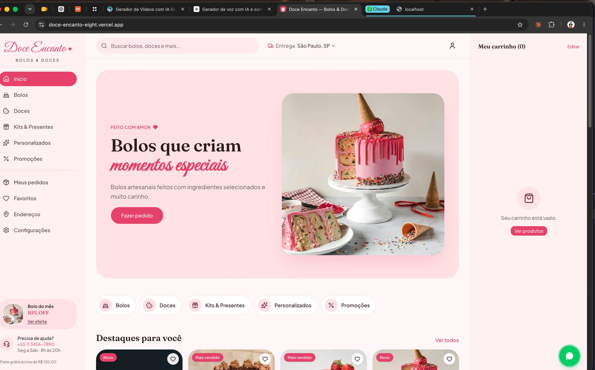
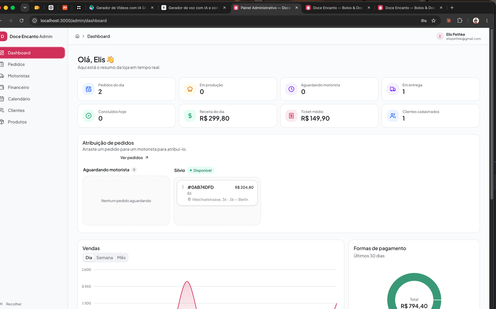
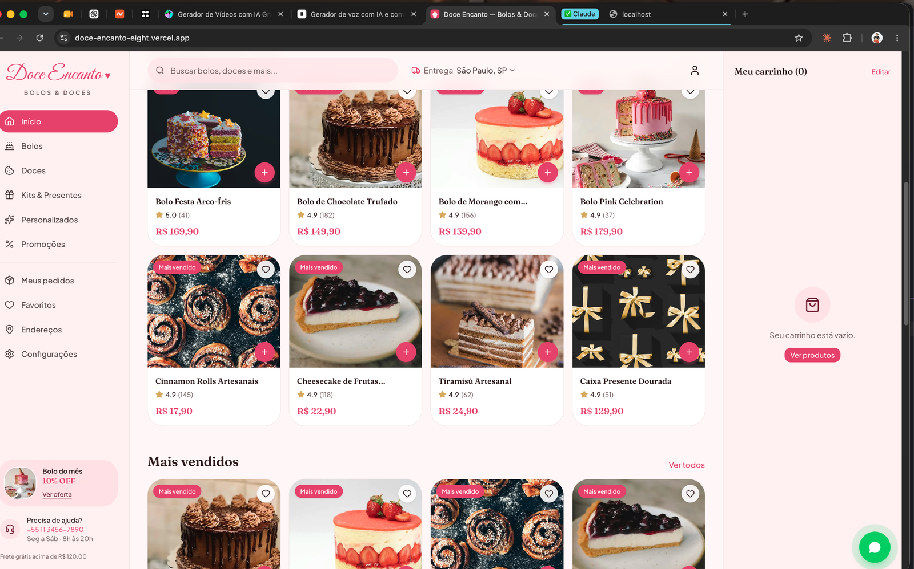
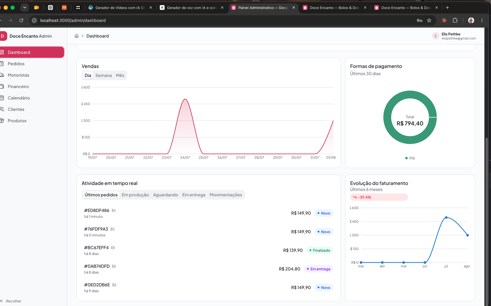
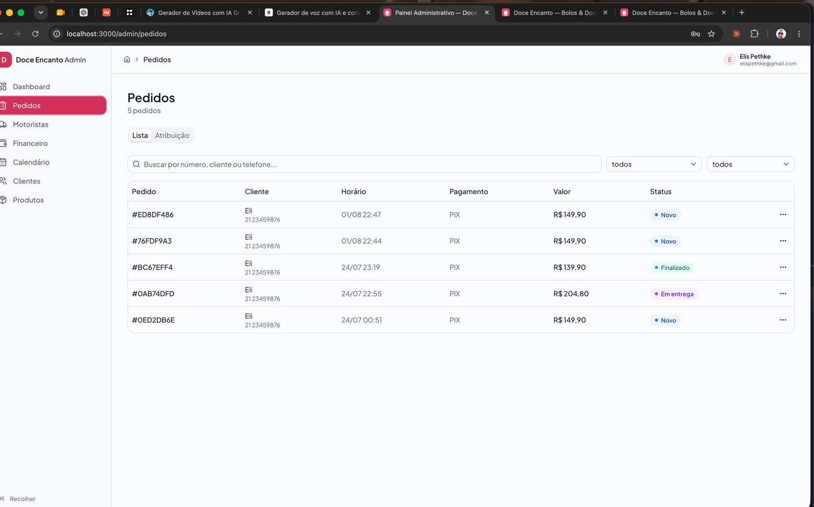

# Doce Encanto 🍰

A full-stack e-commerce platform for an artisanal cake & sweets shop — a customer-facing storefront plus a complete operations backoffice (orders, delivery dispatch, drivers, finance, calendar and customer management) for the shop owner.

Built with **Next.js 16 (App Router)**, **TypeScript**, **Firebase** (Authentication + Firestore) and **Tailwind CSS 4**, and deployed on **Vercel**.

> Live demo: [doce-encanto-eight.vercel.app](https://doce-encanto-eight.vercel.app)

---

## Screenshots

| Storefront | Admin dashboard |
|---|---|
|  |  |

| Product catalog | Sales analytics | Order management |
|---|---|---|
|  |  |  |

---

## Overview

Doce Encanto is split into two independent experiences that share the same Firebase project but never share an authentication session:

- **Storefront** (`/`) — browsing, cart, checkout and a customer account area, aimed at end customers ordering cakes and sweets online.
- **Admin panel** (`/admin`) — a real-time operations dashboard for the shop owner: order pipeline, drag-and-drop driver dispatch, a lightweight financial ledger, a delivery calendar, customer records and product catalog management.

## Features

### Customer storefront
- Product catalog with categories, promotions and highlights (bestsellers, "product of the month", etc.)
- Cart, checkout and order tracking
- Account area: order history, saved addresses, favorites and settings
- Authentication via e-mail/password or Google, with a dedicated live chat thread per order between the customer and the shop

### Admin panel
- **Dashboard** — real-time KPIs (orders today, in production, awaiting driver, in delivery, revenue, average ticket), a sales chart (day/week/month), payment method breakdown and 6-month revenue trend
- **Orders** — full order list with search/filtering and a drag-and-drop dispatch board to assign orders to available drivers
- **Drivers** — driver roster and account provisioning (creates a Firebase Auth account for the driver without disrupting the admin's own session)
- **Financial** — a mini bookkeeping module tied to the order/payment data
- **Calendar** — delivery scheduling view
- **Customers** — customer directory
- **Products** — catalog CRUD

## Implementation & validation

- **Two isolated Firebase App instances.** The storefront and the admin panel each get their own named Firebase `App`/`Auth` instance (`lib/firebase/customer` and `lib/firebase/admin`), so signing in on one never touches the other's session — even in the same browser tab.
- **Admin access is authorization, not just authentication.** Signing in with Firebase Auth is not enough to reach the dashboard: after login, the app checks for a matching `admins/{uid}` Firestore document. If it doesn't exist, the session is signed out immediately and the user sees "Access denied." Admin documents are never created by the client — only manually, in the Firebase console — which is also enforced at the Firestore security-rules level (`allow write: if false` on `admins/{uid}`).
- **Schema-driven form validation.** Every form (customer login, customer sign-up, admin login) is validated with [Zod](https://zod.dev/) schemas through `react-hook-form`, covering: required fields, e-mail format, minimum password length, phone format, and password-confirmation matching. Forms use `noValidate` so the browser's native validation bubble never pre-empts the app's own (localized, styled) error messages — validation behavior is fully controlled by the app, not the browser.
- **Consistent, localized error handling.** Firebase Auth error codes (`auth/user-not-found`, `auth/wrong-password`, `auth/email-already-in-use`, etc.) are mapped to Portuguese, user-facing copy in a single place (`lib/firebase/auth-errors.ts`), so the UI never leaks raw SDK error strings.
- **Firestore security rules** (`firestore.rules`) enforce ownership and role checks server-side for every collection (`orders`, `customers`, `drivers`, `products`, `financialEntries`, `chats`, etc.) — the client-side checks are a UX layer on top of rules that are actually authoritative.

## Testing

The project has an end-to-end test suite built with **Playwright**, running against a real, isolated backend via the **Firebase Emulator Suite** (Auth + Firestore) — no test ever touches the production Firebase project.

**Coverage (18 tests):**

| Suite | What's covered |
|---|---|
| `e2e/customer-login.spec.ts` | Empty-field validation, invalid e-mail format, short password, wrong/non-existent credentials, successful login + redirect |
| `e2e/customer-signup.spec.ts` | Empty-field validation, full-name requirement, invalid e-mail/phone, short password, mismatched password confirmation, successful sign-up + redirect, duplicate e-mail rejection |
| `e2e/admin-login.spec.ts` | Empty-field validation, wrong credentials, access denied for a valid account with no `admins/{uid}` document, successful login + redirect to the dashboard |

Each test seeds its own isolated Firebase Auth user (and, where relevant, Firestore `admins/{uid}` document) through the Admin SDK before exercising the real UI — so tests never depend on shared or pre-existing data and can run in any order.

### Running the tests

```bash
# installs Chromium for Playwright, one-time setup
npx playwright install chromium

# runs the full suite: spins up the Firebase emulators + Next.js dev server,
# then runs all 18 E2E tests headlessly
npm run test:e2e

# lint + type-check + full E2E suite in one command
npm run test:all

# start the Firebase emulators on their own (Auth on :9099, Firestore on :8080,
# Emulator UI on :4000) — useful for manual/local debugging
npm run emulators
```

`playwright.config.ts` automatically starts the Firebase Emulator Suite and a `next dev` instance (with `NEXT_PUBLIC_USE_FIREBASE_EMULATOR=true`) before running the tests, and tears both down afterwards — no manual setup required beyond having a JDK 21+ available for the Firestore emulator.

## Tech stack

| Layer | Technology |
|---|---|
| Framework | Next.js 16 (App Router, Turbopack), React 19, TypeScript |
| Styling / UI | Tailwind CSS 4, Base UI, Framer Motion, `lucide-react` |
| Forms & validation | React Hook Form + Zod |
| Data fetching / state | TanStack Query |
| Backend | Firebase Authentication + Cloud Firestore |
| Drag & drop | `dnd-kit` (dispatch board, product ordering) |
| Charts | Recharts |
| E2E testing | Playwright + Firebase Emulator Suite |
| Deployment | Vercel |

## Getting started

### Prerequisites
- Node.js 20+
- A Firebase project with **Email/Password** and **Google** sign-in enabled
- JDK 21+ (only required to run the Firebase emulators / E2E tests)

### Setup

```bash
npm install
cp .env.example .env.local   # fill in your Firebase Web app config
npm run dev
```

Open [http://localhost:3000](http://localhost:3000) for the storefront and [http://localhost:3000/admin/login](http://localhost:3000/admin/login) for the admin panel.

> To reach the admin dashboard, a Firebase Auth account must exist **and** have a matching document at `admins/{uid}` in Firestore — this is created manually (Firebase Console), never by the app itself.

### Available scripts

```bash
npm run dev         # start the dev server (Turbopack)
npm run build        # production build
npm run start         # serve the production build
npm run lint          # ESLint
npm run test:e2e      # Playwright E2E suite (spins up emulators automatically)
npm run test:all      # lint + type-check + E2E suite
npm run emulators     # Firebase Emulator Suite only (Auth + Firestore + UI)
```

## Project structure

```
src/
  app/                    # Next.js App Router routes
    (public)/             # storefront: home, loja, produto, carrinho, checkout, conta, login, cadastro
    admin/
      (auth)/              # admin login
      (dashboard)/         # dashboard, pedidos, motoristas, financeiro, calendario, clientes, produtos
  features/                # feature-sliced UI: components, schemas, hooks per domain
    customer/auth/         # customer login/signup forms + Zod schemas
    admin/                 # dashboard, orders, drivers, financial, calendar, customers, products, chat
  providers/                # CustomerAuthProvider / AuthProvider (Firebase auth state)
  contexts/                 # React contexts consumed by the providers above
  services/firestore/       # typed Firestore read/write functions per collection
  repositories/             # generic Firestore repository helper
  lib/firebase/
    customer/                # isolated Firebase App/Auth/Firestore instance for the storefront
    admin/                   # isolated Firebase App/Auth/Firestore instance for the admin panel
    use-emulator.ts          # NEXT_PUBLIC_USE_FIREBASE_EMULATOR switch used by tests
e2e/                         # Playwright E2E specs + Firebase Admin SDK test fixtures
firestore.rules              # Firestore security rules (source of truth for authorization)
playwright.config.ts         # spins up emulators + dev server for the E2E suite
```

## Deployment

The app is deployed on [Vercel](https://vercel.com), built directly from the `main` branch. Firebase Authentication and Firestore run against the production Firebase project (`doce-encanto-b6ecf`); the Firebase Emulator Suite is used exclusively for local development and the E2E test suite, never in production.
